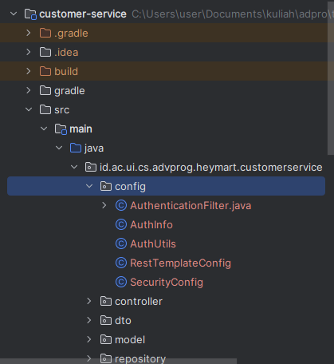

# :: Roles
Existing roles:
- ``ROLE_ADMIN`` role meant for admin
- ``ROLE_CUSTOMER`` role meant for customer
- ``ROLE_USER`` every registered user has this role automatically

# :: Domains
Domains in which you can access the endpoints.
- **Local**: localhost
- **Staging**: 35.198.196.1

# :: API Endpoints
## Signup/Register
### Request
**Endpoint**: ``http://{domain}/api/auth/signup``

**HTTP Method**: ``POST``

**JSON Request Payload**:
```json
{ // example
    "username": "user",
    "email": "user@eshop.co",
    "role": ["ROLE_ADMIN", "ROLE_CUSTOMER"], // list of roles the user gets
    "password": "{password}",
    "firstName": "user",
    "lastName": "-",
    "dob": "2002-07-07 00:00:00" // date of birth
}
```
### Response
**CASE**: Empty/blank username, email, password, firstName, or lastName/wrong format for dob
- Status Code: 403 Forbidden

**CASE**: Valid request
- Status Code: 20 Ok
- Response Body:
```json
{
    "message": "User registered successfully!"
}
```

**CASE**: Username already taken
- Status Code: 400 Bad Request
- Response Body:
```json
{
  "message": "Error: Username is already taken!"
}
```

**CASE**: Email already taken
- Status Code: 400 Bad Request
- Response Body:
```json
{
  "message": "Error: Email is already in use!"
}
```

**CASE**: Internal server error
- Status Code: 500 Internal Server Error
- Response Body:
```json
{
  "message": "Internal server error"
}
```

## Login
### Request
**Endpoint**: ``http://{domain}/api/auth/login``

**HTTP Method**: ``POST``

**JSON Request Payload**:
```json
{
    "username": "{username}",
    "password": "{password}"
}
```
### Response
**CASE**: Empty/blank username, password
- Status Code: 403 Forbidden

**CASE**: Valid request
- Status Code: 20 Ok
- Response Body:
```json
{
  "token": "{token}",
  "type": "Bearer",
  "id": 1, // user id datatype: Long
  "username": "{username}",
  "email": "{email}",
  "roles": [ // example
    "ROLE_USER",
    "ROLE_ADMIN"
  ]
}
```

**CASE**: Failure
- Status Code: 401 Unauthorized
- Response Body:
```json
{
    "message": "Login failed. Please try again."
}
```

## Check Token
### Request
**Endpoint**: ``http://{domain}/api/auth/check-token``

**HTTP Method**: ``POST``

**JSON Request Payload**:
```json
{
    "token": "{token}" // without "Bearer " prefix
}
```

### Response
**CASE**: Empty/blank token
- Status Code: 403 Forbidden

**CASE**: Valid request
- Status Code: 20 Ok
- Response Body:
```json
{
  "message": "Token validation success.",
  "data": {
    "id": 1, // user id datatype: Long
    "email": "{email}",
    "username": "{username}",
    "firstName": "{first name}",
    "lastName": "{last name}",
    "authorities": [
      "ROLE_ADMIN",
      "ROLE_USER"
    ]
  }
}
```

**CASE**: Invalid token
- Status Code: 20 Ok
- Response Body:
```json
{
  "message": "Unauthorized access."
}
```

# :: How to Use
## 1. Dependencies
Add these following dependencies into your ``build.gradle.kts`` file:
```kotlin
dependencies {
    implementation("org.springframework.boot:spring-boot-starter-security")
    implementation("org.springframework.boot:spring-boot-starter-webflux")
}
```

My full project dependencies used in my testing repository:
```kotlin
val junitJupiterVersion = "5.9.1"

dependencies {
    implementation("org.springframework.boot:spring-boot-starter-thymeleaf")
    implementation("org.springframework.boot:spring-boot-starter-web")
    compileOnly("org.projectlombok:lombok")
    developmentOnly("org.springframework.boot:spring-boot-devtools")
    annotationProcessor("org.springframework.boot:spring-boot-configuration-processor")
    annotationProcessor("org.projectlombok:lombok")


    implementation("org.springframework.boot:spring-boot-starter-data-jpa")
    runtimeOnly("com.h2database:h2")
    runtimeOnly("org.postgresql:postgresql")


    testImplementation("org.springframework.boot:spring-boot-starter-test")
    testImplementation("org.junit.jupiter:junit-jupiter-api:$junitJupiterVersion")
    testRuntimeOnly("org.junit.jupiter:junit-jupiter-engine:$junitJupiterVersion")

    implementation("org.springframework.boot:spring-boot-starter-security")
    implementation("org.springframework.boot:spring-boot-starter-webflux")
}
```
Don't forget to reload gradle and build the project.

## 2. Add Properties into application.properties
Add these into your project's ``application.properties``
```properties
spring.mvc.pathmatch.matching-strategy=ANT_PATH_MATCHER

app.mcs.authentication.domain=http://35.198.196.1
app.mcs.authentication.checktoken.route=/api/auth/check-token
```

## 3. Create Package and Files
Create a package named "config" and in it, create the java files specified in the following image:



## 4. RestTemplateConfig.java
In this file, we define a bean for RestTemplate. RestTemplate is what we will use to communicate with the authentication endpoints.
```java
import org.springframework.boot.web.client.RestTemplateBuilder;
import org.springframework.context.annotation.Bean;
import org.springframework.context.annotation.Configuration;
import org.springframework.web.client.RestTemplate;

@Configuration
public class RestTemplateConfig {

    @Bean
    public RestTemplate restTemplate(RestTemplateBuilder builder) {
        return builder.build();
    }
}
```

## 5. AuthInfo
This file contains the object class that we will use to help us access authenticated user data.
```java
import lombok.Getter;
import lombok.Setter;

import java.util.List;

@Getter
@Setter
public class AuthInfo {
    private Long id;
    private String email;
    private String username;
    private String firstName;
    private String lastName;
    private List<String> authorities;
}
```

## 6. AuthenticationFilter
This filter is used to authenticate and get user from every endpoint request coming to the project. This filter will check the bearer token and if it's valid, will inject the user details (AuthInfo) into the SecurityContextHolder.
```java
import com.fasterxml.jackson.annotation.JsonProperty;
import com.fasterxml.jackson.databind.ObjectMapper;
import jakarta.servlet.FilterChain;
import jakarta.servlet.ServletException;
import jakarta.servlet.http.HttpServletRequest;
import jakarta.servlet.http.HttpServletResponse;
import lombok.Getter;
import lombok.Setter;
import org.springframework.beans.factory.annotation.Autowired;
import org.springframework.beans.factory.annotation.Value;
import org.springframework.http.*;
import org.springframework.security.core.GrantedAuthority;
import org.springframework.security.core.authority.SimpleGrantedAuthority;
import org.springframework.security.core.context.SecurityContextHolder;
import org.springframework.stereotype.Component;
import org.springframework.web.client.RestTemplate;

import org.springframework.security.authentication.UsernamePasswordAuthenticationToken;
import org.springframework.web.filter.OncePerRequestFilter;

import java.io.IOException;
import java.util.List;
import java.util.stream.Collectors;

@Component
public class AuthenticationFilter extends OncePerRequestFilter {

    @Autowired
    private RestTemplate template;

    @Value("${app.mcs.authentication.domain}")
    private String authDomain;

    @Value("${app.mcs.authentication.checktoken.route}")
    private String checkTokenRoute;

    @Override
    protected void doFilterInternal(HttpServletRequest request, HttpServletResponse response, FilterChain filterChain) throws ServletException, IOException {
        String authHeader = request.getHeader("Authorization");
        if (authHeader != null && authHeader.startsWith("Bearer ")) {
            authHeader = authHeader.substring(7);

            UsernamePasswordAuthenticationToken auth = validateToken(authHeader);

            SecurityContextHolder.getContext().setAuthentication(auth);
        }
        filterChain.doFilter(request, response);
    }

    private UsernamePasswordAuthenticationToken validateToken(String authHeader){
        try {
            //REST call to AUTH service
            TokenCheckRequest requestObject = new TokenCheckRequest();
            requestObject.setToken(authHeader);

            HttpEntity<TokenCheckRequest> request = new HttpEntity<>(requestObject);

            ResponseEntity<TokenCheckResponse> response = template.exchange(authDomain + checkTokenRoute, HttpMethod.POST, request, TokenCheckResponse.class);

            TokenCheckResponse responseObject = response.getBody();
            assert responseObject != null;
            if (responseObject.getData() != null) {
                ObjectMapper mapper = new ObjectMapper();
                AuthInfo authInfo = mapper.convertValue(responseObject.getData(), AuthInfo.class);
                List<GrantedAuthority> authorities = authInfo.getAuthorities().stream()
                        .map(SimpleGrantedAuthority::new)
                        .collect(Collectors.toList());
                return UsernamePasswordAuthenticationToken.authenticated(
                        authInfo, null, authorities
                );
            }
        } catch (Exception e){
            throw new RuntimeException("Unauthorized access");
        }
        return null;
    }
}

@Getter
@Setter
class TokenCheckResponse{
    @JsonProperty
    private String message;
    @JsonProperty
    private Object data;
}

@Getter
@Setter
class TokenCheckRequest{
    @JsonProperty
    private String token;
}

```

## 7. SecurityConfig.java
This will configure the level of authorization needed for specified endpoints in the project.
```java
import org.springframework.beans.factory.annotation.Autowired;
import org.springframework.context.annotation.Bean;
import org.springframework.context.annotation.Configuration;
import org.springframework.security.config.annotation.web.builders.HttpSecurity;
import org.springframework.security.config.annotation.web.configuration.EnableWebSecurity;
import org.springframework.security.config.annotation.web.configurers.AbstractHttpConfigurer;
import org.springframework.security.web.SecurityFilterChain;

import org.springframework.security.web.authentication.UsernamePasswordAuthenticationFilter;

@Configuration
@EnableWebSecurity
public class SecurityConfig {

    @Autowired
    AuthenticationFilter authenticationFilter;

    @Bean
    public SecurityFilterChain securityFilterChain(HttpSecurity httpSecurity) throws Exception {
        return httpSecurity
                .csrf(AbstractHttpConfigurer::disable)
                .authorizeHttpRequests(auth -> auth
                        .requestMatchers("/**/public/**").permitAll()
                        .requestMatchers("/**/admin/**").hasRole("ADMIN")
                        .requestMatchers("/**/customer/**").hasRole("CUSTOMER")
                        .requestMatchers("/**/user/**").hasRole("USER")
                        .anyRequest().authenticated()
                ).addFilterBefore(authenticationFilter, UsernamePasswordAuthenticationFilter.class)
                .build();
    }
}
```
Explanations:
- Anyone can access endpoints that has "/public/" in the url
- Only authenticated users with the role "ROLE_ADMIN" can access endpoints that has "/admin/" in the url
- Only authenticated users with the role "ROLE_CUSTOMER" can access endpoints that has "/customer/" in the url
- Only authenticated users with the role "ROLE_USER" can access endpoints that has "/user/"
- Any other endpoints needs the user to be authenticated to access them. No roles are specified
- AuthenticationFilter is used to authenticate user

## 8. AuthUtils
This class is filled with utilities to access authenticated user's details.
```java
import org.springframework.security.core.context.SecurityContextHolder;
import org.springframework.stereotype.Component;

import java.util.List;

@Component
public class AuthUtils {

    public static synchronized Long getUserId(){
        Object principal = SecurityContextHolder.getContext().getAuthentication().getPrincipal();
        if (principal instanceof AuthInfo){
            return ((AuthInfo) principal).getId();
        }

        throw new RuntimeException("User is not authenticated");
    }

    public static synchronized String getEmail(){
        Object principal = SecurityContextHolder.getContext().getAuthentication().getPrincipal();
        if (principal instanceof AuthInfo){
            return ((AuthInfo) principal).getEmail();
        }

        throw new RuntimeException("User is not authenticated");
    }

    public static synchronized String getUsername(){
        Object principal = SecurityContextHolder.getContext().getAuthentication().getPrincipal();
        if (principal instanceof AuthInfo){
            return ((AuthInfo) principal).getUsername();
        }

        throw new RuntimeException("User is not authenticated");
    }

    public static synchronized String getFirstName(){
        Object principal = SecurityContextHolder.getContext().getAuthentication().getPrincipal();
        if (principal instanceof AuthInfo){
            return ((AuthInfo) principal).getFirstName();
        }

        throw new RuntimeException("User is not authenticated");
    }

    public static synchronized String getLastName(){
        Object principal = SecurityContextHolder.getContext().getAuthentication().getPrincipal();
        if (principal instanceof AuthInfo){
            return ((AuthInfo) principal).getLastName();
        }

        throw new RuntimeException("User is not authenticated");
    }

    public static synchronized List<String> getRoles(){
        Object principal = SecurityContextHolder.getContext().getAuthentication().getPrincipal();
        if (principal instanceof AuthInfo){
            return ((AuthInfo) principal).getAuthorities();
        }

        throw new RuntimeException("User is not authenticated");
    }
}

```
## Usage Example: TestController
```java
package id.ac.ui.cs.advprog.heymart.customerservice.controller;

import id.ac.ui.cs.advprog.heymart.customerservice.config.AuthUtils;
import id.ac.ui.cs.advprog.heymart.customerservice.dto.response.GeneralResponse;
import lombok.extern.log4j.Log4j2;
import org.apache.coyote.BadRequestException;
import org.springframework.beans.factory.annotation.Autowired;
import org.springframework.http.HttpStatus;
import org.springframework.http.ResponseEntity;
import org.springframework.web.bind.annotation.*;

@RestController
@RequestMapping("/api/test")
@Log4j2
public class TestController {


    @GetMapping("/public/get")
    public ResponseEntity<GeneralResponse> getPublic(){
        GeneralResponse response = new GeneralResponse();
        response.setStatus("OK");
        response.setMessage("Success");
        response.setData(AuthUtils.getRoles());
        return new ResponseEntity<>(response, HttpStatus.OK);
    }

    @GetMapping("/admin/get")
    public ResponseEntity<GeneralResponse> getAdmin(){
        GeneralResponse response = new GeneralResponse();
        response.setStatus("OK");
        response.setMessage("Success");
        response.setData(AuthUtils.getRoles());
        return new ResponseEntity<>(response, HttpStatus.OK);
    }

    @GetMapping("/user/get")
    public ResponseEntity<GeneralResponse> getUser(){
        GeneralResponse response = new GeneralResponse();
        response.setStatus("OK");
        response.setMessage("Success");
        response.setData(AuthUtils.getRoles());
        return new ResponseEntity<>(response, HttpStatus.OK);
    }

    @GetMapping("/customer/get")
    public ResponseEntity<GeneralResponse> getCustomer(){
        GeneralResponse response = new GeneralResponse();
        response.setStatus("OK");
        response.setMessage("Success");
        response.setData(AuthUtils.getRoles());
        return new ResponseEntity<>(response, HttpStatus.OK);
    }
}

```